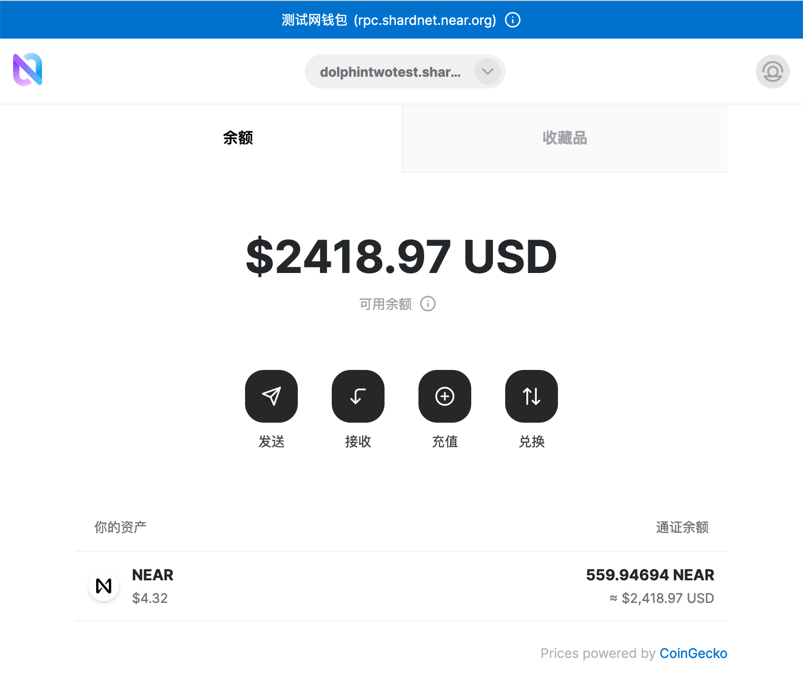

# challange 001

## 创建钱包

> 之前已经创建过【dolphintwo.shardnet.near】，本文档将已【dolphintwotest】为演示id再次记录

网页钱包地址: [https://wallet.shardnet.near.org/](https://wallet.shardnet.near.org/)

打开上述地址，进入钱包页面创建一个新的shardnet钱包，点击【创建账户】，输入你希望的钱包id，看看有没有被注册，太好了【dolphintwotest】当前没有被注册。


点击【保留账户ID】，选择设置【高级安全】-【安全助记词】为恢复方式，点击继续，生成助记词，当前页面显示12个英文单词，请务必用手抄方式记录好，这是该种设置下恢复账户的唯一办法。


点击继续，验证刚刚记录的助记词，账户账户将执行创建。创建完成后，输入刚刚的12个助记词，进行登陆操作。此时，网页显示钱包余额，钱包创建完成。


## 安装near-cli工具

> near-cli是由node编写的，所以我们需要先安装nodejs

```bash
sudo apt update && sudo apt upgrade -y
curl -sL https://deb.nodesource.com/setup_18.x | sudo -E bash -  
sudo apt install build-essential nodejs
# 加载环境变量
source ~/.bashrc
# 验证node/npm版本
node -v
npm -v
sudo npm install -g near-cli
```

查看near-cli版本，验证near已经安装成功。


### 验证人状态查看

安装完成后可以使用`NEAR-CLI`来查看网络验证人状态，当前near有四个公开网络：

- GuildNet
- TestNet
- MainNet
- Shardnet

当前我们需要连接的是Shardnet网络。

```bash
# 加载网络参数
echo 'export NEAR_ENV=shardnet' >> ~/.bashrc
source ~/.bashrc
```

#### CLI操作演示

> 提案
验证者的提案表明他们想进入验证者集，必须保证验证节点拥有最低席位价数量的near。

```bash
near proposals
```


> 当前验证人

```bash
near validators current
```


> 下周期验证人

```bash
near validators next
```


## End

至此，near-shardnet 001部分完结。
感谢！
