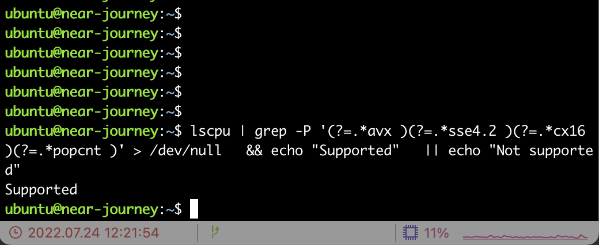
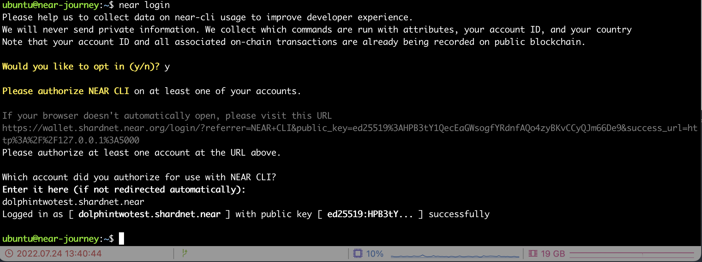

# challange 002

> 本章将记录节点安装

## 安装near节点

注意near节点的硬件需求：

|硬件|最低需求|
|---|-----|
|CPU|4核心带AVX指令集|
|RAM|8G DDR4以上|
|存储|500GB|

使用以下命令确认cpu支持，输出`Supported`及为符合要求。

```bash
lscpu | grep -P '(?=.*avx )(?=.*sse4.2 )(?=.*cx16 )(?=.*popcnt )' > /dev/null \
  && echo "Supported" \
  || echo "Not supported"
```



### 安装编译依赖

```bash
# 安装开发者工具
sudo apt install -y git binutils-dev libcurl4-openssl-dev zlib1g-dev libdw-dev libiberty-dev cmake gcc g++ python docker.io protobuf-compiler libssl-dev pkg-config clang llvm cargo ccze

# 安装pip
sudo apt install python3-pip
USER_BASE_BIN=$(python3 -m site --user-base)/bin
export PATH="$USER_BASE_BIN:$PATH"

# 安装编译以来
sudo apt install clang build-essential make

# 安装rust和cargo
curl --proto '=https' --tlsv1.2 -sSf https://sh.rustup.rs | sh
# 加载rust
source $HOME/.cargo/env
```


### 编译安装nearcore

```bash
# clone仓库
git clone https://github.com/near/nearcore
cd nearcore
git fetch

# 最新的commit请在这里查看https://github.com/near/stakewars-iii/blob/main/commit.md
git checkout 0f81dca95a55f975b6e54fe6f311a71792e21698

# 编译nearcore二进制文件
cargo build -p neard --release --features shardnet
```

参照上方命令行编译安装`nearcore`二进制文件。编译所需时间较长，可以适当提高硬件配置。
编译好的二进制文件会存放在repo的`target/release/`下。


### 启动节点

> 1. 初始化工作目录

```bash
# 初始化工作目录，~/.near也可以是别的数据目录，这里我指定/data/near目录，因为我把aws购买的卷挂载到data目录下了
./target/release/neard --home /data/near init --chain-id shardnet --download-genesis
```


初始化过的目录下将有`config.json`,`genesis.json`,`node_key.json`三个文件。

- `config.json` 里面是节点如何工作的配置参数。 `config.json`包含节点在网络上运行所需的信息、如何与对等方通信以及如何达成共识。
- `genesis.json` 存储着网络在创世时开始使用的所有数据的文件。这包含初始帐户、合同、访问密钥和其他代表区块链初始状态的记录。它相当于一个网络的快照。
- `node_key.json` 这个文件里写着节点的公私钥。`account_id`则是验证节点所需的参数。

### 替换/修改config文件

`config.json`文件有两处地方需要修改:

- `boot_nodes`
- `tracked_shards` 修改为："tracked_shards": [0]

这里我们直接用官方提供的config文件替换

```bash
rm /data/near/config.json
wget -O /data/near/config.json https://s3-us-west-1.amazonaws.com/build.nearprotocol.com/nearcore-deploy/shardnet/config.json
```

### 获取最新的快照genesis文件

```bash
cd /data/near
wget https://s3-us-west-1.amazonaws.com/build.nearprotocol.com/nearcore-deploy/shardnet/genesis.json
```

### 启动节点同步

```bash
# > cd ~/nearcore
# > ./target/release/neard --home /data/near run

# 这里我使用`systemd unit`管理进程和日志
sudo tee <<EOF >/dev/null /lib/systemd/system/near-shardnet.service
[Unit]
Description=Near Node Daemon
After=network.target

[Service]
Type=simple
User=ubuntu
Group=ubuntu
StandardOutput=syslog
StandardError=syslog
SyslogIdentifier=near-shardnet
ExecStart=/home/ubuntu/nearcore/target/release/neard --home=/data/near run
ExecStop=/bin/kill -INT \$MAINPID
Restart=on-failure
RestartSec=30
KillSignal=SIGINT
TimeoutStopSec=45
KillMode=mixed

[Install]
WantedBy=multi-user.target
EOF

sudo systemctl daemon-reload
sudo systemctl start near-shardnet.service

# 使用journalctl查看日志信息
sudo journalctl -u near-shardnet -f | ccze -A
```


同步过程是先同步headers然后同步块文件。当同步完成后，可以看到日志块高和[浏览器高度](https://explorer.shardnet.near.org/blocks)同步是一致的。


## 激活验证人节点

### 终端登录钱包

首先使用CLI登陆钱包账户

```bash
near login
```


授权账户访问后，浏览器和终端先后输入账户id确认授权（本例中为`dolphintwotest.shardnet.near`）,钱包登陆成功。

登陆成功后，CLI显示:
`Logged in as [ dolphintwotest.shardnet.near ] with public key [ ed25519:HPB3tY... ] successfully`



## 生成validator_key文件

```bash
near generate-key dolphintwotest

# 注意此处拷贝的不是dolphintwotest.shardnet.near.json文件
cp ~/.near-credentials/shardnet/dolphintwotest.json /data/near/validator_key.json
```

还需要修改`validator_key.json`的内容：

- `account_id`修改为`dolphintwotest.factory.shardnet.near`。
- 将`private_key`修改成`secret_key`

最后文件格式应该是这样的：

```json
{
    "account_id":"dolphintwotest.factory.shardnet.near",
    "public_key":"ed25519:GPGmYYCSHUkbPwvyqaf3qbpDaLxUynqQhozZtDJzLABR",
    "private_key":"ed25519:*********************"
}
```

### 重启以加载validator_key

> 此操作应该在同步完成后执行，否则提案验证人不生效

```bash
sudo systemctl restart near-shardnet.service
```

提案成为验证人必须满足一下要求：

- 节点同步追上高度
- `validator_key.json`文件设置正确
- 合约必须使用`validator_key.json`中的`public_key`初始化
- `account_id`必须设置为质押池合约id
- 必须有足够的near质押以进入席位
- 必须通过`ping`合约提交提案
- 提案成为验证人后，需要经过2-3个周期才能完成加入
- 成为验证人后，出块率不得低于90%

## End

至此，near-shardnet 002部分完结。
感谢！
