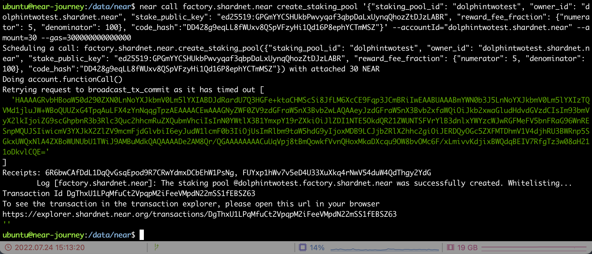
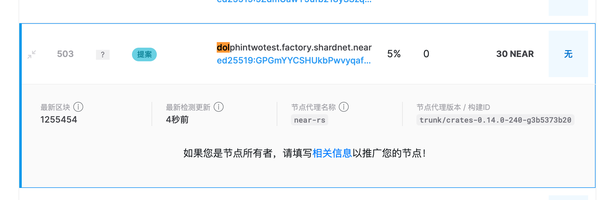
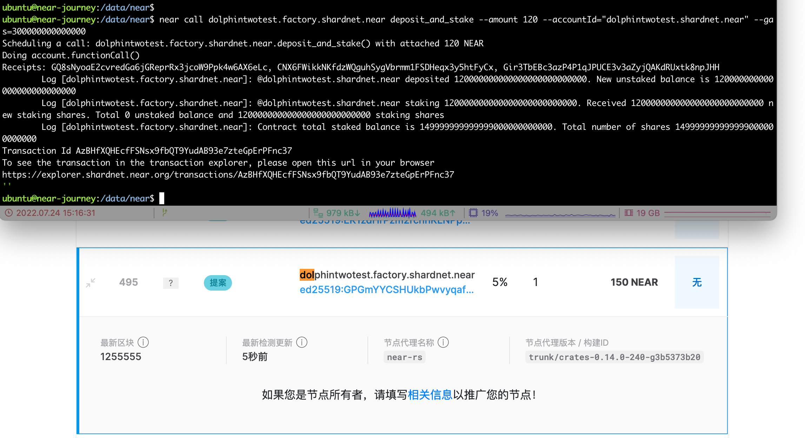

# challange 003

## 进入验证人池

NEAR使用带有白名单质押合约的质押池factory来确保委托人的资金安全。为了在NEAR上运行验证器，必须将质押池部署到NEAR帐户并集成到NEAR验证器节点中。委托人必须使用UI或命令行来质押池。质押池是部署到NEAR账户的智能合约。

### 部署`staking pool contract`

```bash
near call factory.shardnet.near create_staking_pool '{"staking_pool_id": "<pool id>", "owner_id": "<accountId>", "stake_public_key": "<public key>", "reward_fee_fraction": {"numerator": 5, "denominator": 100}, "code_hash":"DD428g9eqLL8fWUxv8QSpVFzyHi1Qd16P8ephYCTmMSZ"}' --accountId="<accountId>" --amount=30 --gas=300000000000000
```

参数说明：

- `Pool ID`: 质押池的名字，格式是`{pool_id}.{staking_pool_factory}`，本例中为`dolphintwotest.factory.shardnet.near`
- `Owner ID`: 质押池的管理账户，即最开始我们创建的那个账户，本例中为`dolphintwotest.shardnet.near`
- `5`: 节点手续费，5为收取5%的质押收益作为节点手续费
- `Account Id`: 部署和签名账户，本例中和`Owner ID`一致

所以，以下为我创建的demo

```bash
# demo
near call factory.shardnet.near create_staking_pool '{"staking_pool_id": "dolphintwotest", "owner_id": "dolphintwotest.shardnet.near", "stake_public_key": "ed25519:GPGmYYCSHUkbPwvyqaf3qbpDaLxUynqQhozZtDJzLABR", "reward_fee_fraction": {"numerator": 5, "denominator": 100}, "code_hash":"DD428g9eqLL8fWUxv8QSpVFzyHi1Qd16P8ephYCTmMSZ"}' --accountId="dolphintwotest.shardnet.near" --amount=30 --gas=300000000000000
```



创建完成后，可以在浏览器上看到验证人信息。[https://explorer.shardnet.near.org/nodes/validators](https://explorer.shardnet.near.org/nodes/validators)，目前验证人是提案状态。



## 常用的交易

> 示例：质押NEAR

```bash
near call <staking_pool_id> deposit_and_stake --amount <amount> --accountId <accountId> --gas=300000000000000

# demo
# near call dolphintwotest.factory.shardnet.near deposit_and_stake --amount 120 --accountId="dolphintwotest.shardnet.near" --gas=300000000000000
```

此时浏览器上应该显示有30+120的质押量，质押人应该只有我一个人。


> 以下命令使用暂略过

```bash
# 解质押NEAR
near call <staking_pool_id> unstake '{"amount": "<amount yoctoNEAR>"}' --accountId <accountId> --gas=300000000000000

# 解质押所有NEAR
near call <staking_pool_id> unstake_all --accountId <accountId> --gas=300000000000000

# 赎回
near call <staking_pool_id> withdraw '{"amount": "<amount yoctoNEAR>"}' --accountId <accountId> --gas=300000000000000

# 赎回所有
near call <staking_pool_id> withdraw_all --accountId <accountId> --gas=300000000000000

# Ping
near call <staking_pool_id> ping '{}' --accountId <accountId> --gas=300000000000000

# 已质押数量查询
near view <staking_pool_id> get_account_staked_balance '{"account_id": "<accountId>"}'

# 解质押数量查询
near view <staking_pool_id> get_account_unstaked_balance '{"account_id": "<accountId>"}'

# 可赎回数量查询
near view <staking_pool_id> is_account_unstaked_balance_available '{"account_id": "<accountId>"}'

# Pause / Resume Staking
near call <staking_pool_id> pause_staking '{}' --accountId <accountId>
near call <staking_pool_id> resume_staking '{}' --accountId <accountId>
```

## End

至此，near-shardnet 003部分完结。
感谢！
