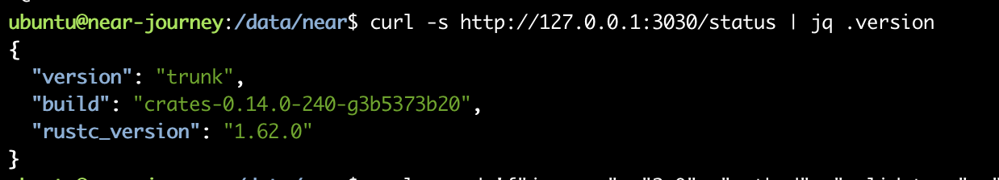
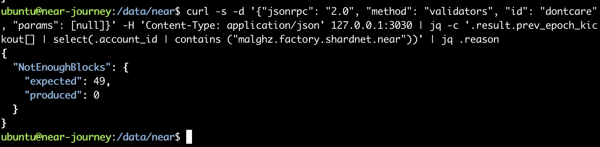
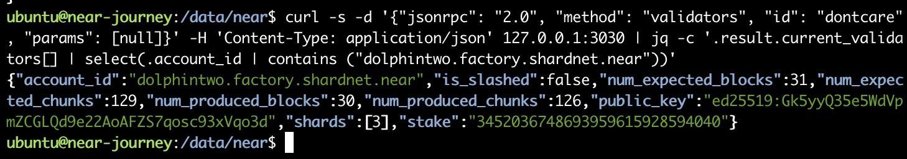
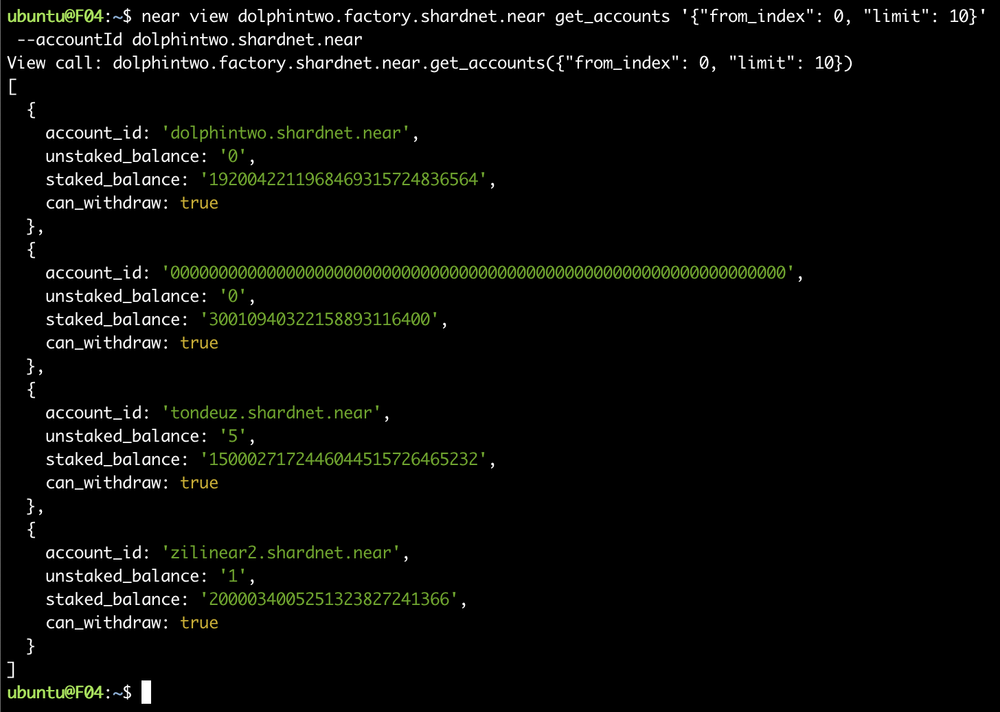

# challange 004

> 本章为检查节点状态

## 查看节点日志

```bash
journalctl -n 100 -f -u near-shardnet.service | ccze -A
```

输出的日志分析

```logfile
# 这是还在同步追块下载区块文件进度
Jul 24 06:47:45 near-journey near-shardnet[74590]: 2022-07-24T06:47:45.707550Z  INFO stats: # 1252998 Downloading blocks 89.11% (1364 left; at 1252997) 31 peers ⬇ 2.05 MB/s ⬆ 881 kB/s 7.50 bps 161 Tgas/s CPU: 113%, Mem: 1.73 GB

# 这是同步完成的日志，1254407为高度，高度应该是在不断变化的，100个验证人，30个连接peers
Jul 24 14:48:51 near-journey near-shardnet[74590]: 2022-07-24T06:48:51.655966Z  INFO stats: # 1254407 GKfNDepK3ijdi1bYQ5Q8UQgtAA58jGBhKtPBvxQopdbt Validator | 100 validators 30 peers ⬇ 448 kB/s ⬆ 809 kB/s 0.80 bps 6.37 Tgas/s CPU: 77%, Mem: 2.01 GB
```

## 通过接口查看节点状态

> 官方文档：[https://docs.near.org/docs/api/rpc](https://docs.near.org/docs/api/rpc)

- 查看节点版本

```bash
curl -s http://127.0.0.1:3030/status | jq .version
```



- 查看被踢出验证人的原因

```bash
curl -s -d '{"jsonrpc": "2.0", "method": "validators", "id": "dontcare", "params": [null]}' -H 'Content-Type: application/json' 127.0.0.1:3030 | jq -c '.result.prev_epoch_kickout[] | select(.account_id | contains ("<POOL_ID>"))' | jq .reason
```

此处因为我不是被踢出状态，我查了别人的，可以看到他是因为出块率低被踢出的。


- 查看出块信息

```bash
curl -s -d '{"jsonrpc": "2.0", "method": "validators", "id": "dontcare", "params": [null]}' -H 'Content-Type: application/json' 127.0.0.1:3030 | jq -c '.result.current_validators[] | select(.account_id | contains ("POOL_ID"))'
```

可以看到查询的节点出块率是30/31，chunks参与度是126/129，没有被slash，节点状态良好。


- 查看质押信息

```bash
near view <your pool>.factory.shardnet.near get_accounts '{"from_index": 0, "limit": 10}' --accountId <accountId>.shardnet.near
```

质押者包含我自抵押的账户一共四名，以及质押的数量，是否能withdraw等信息。


## End

至此，near-shardnet 004部分完结。
感谢！
