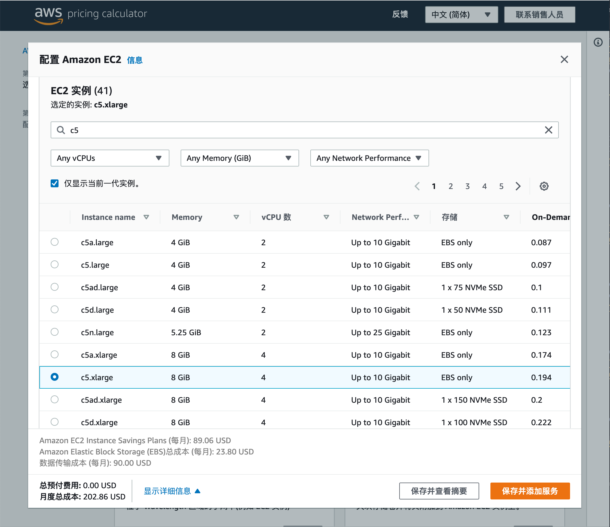

# challange 005

> 在公有云上部署near节点

## 在AWS上部署

新建一台c5.xlarge节点，硬盘200G

通过估算大致分析出节点一个月费用如下，流量估算为1TB/M，大概200USD每月。

## 加入验证人

参照之前001-004的文章，完成操作
[./001.md](./001.md)
[./002.md](./002.md)
[./003.md](./003.md)
[./004.md](./004.md)

## End

至此，near-shardnet 005部分完结。
感谢！
