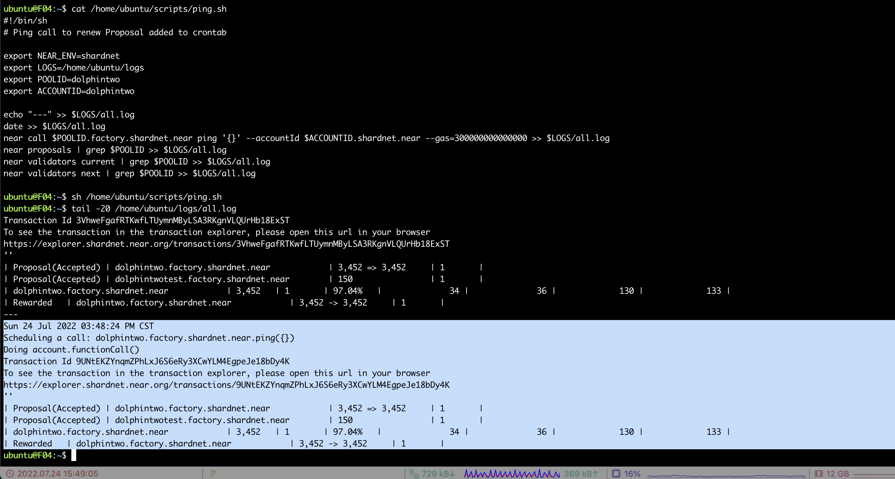
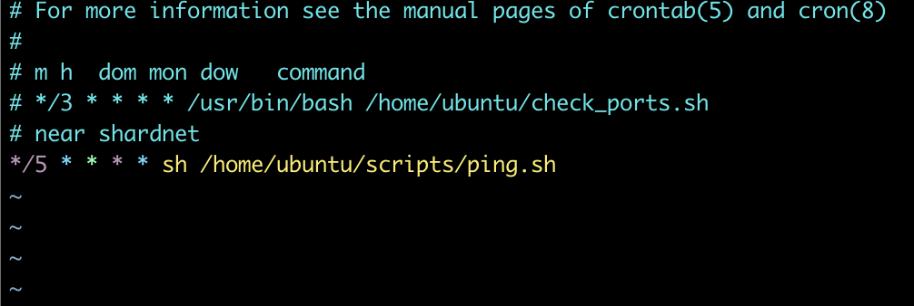
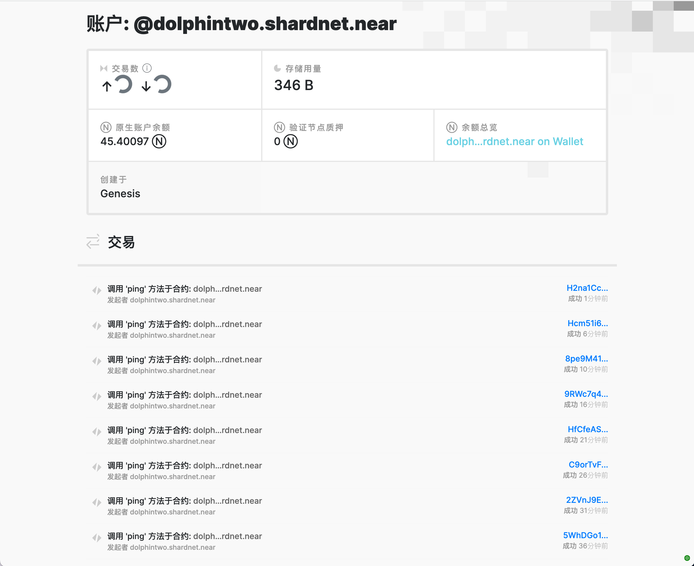

# challange 006

> 创建一个crontab任务用来自动执行ping操作

## 创建脚本

以下为脚本内容，存储为`/home/ubuntu/scripts/ping.sh`

```bash
#!/bin/sh
# Ping call to renew Proposal added to crontab

export NEAR_ENV=shardnet
export LOGS=/home/ubuntu/logs
export POOLID=dolphintwo
export ACCOUNTID=dolphintwo

echo "---" >> $LOGS/all.log
date >> $LOGS/all.log
near call $POOLID.factory.shardnet.near ping '{}' --accountId $ACCOUNTID.shardnet.near --gas=300000000000000 >> $LOGS/all.log
near proposals | grep $POOLID >> $LOGS/all.log
near validators current | grep $POOLID >> $LOGS/all.log
near validators next | grep $POOLID >> $LOGS/all.log
```

执行一次查看结果：


写入crontab

```bash
crontab -e

# */5 * * * * sh /home/ubuntu/scripts/ping.sh
```



浏览器查看结果



## End

至此，near-shardnet 006部分完结。
感谢！
