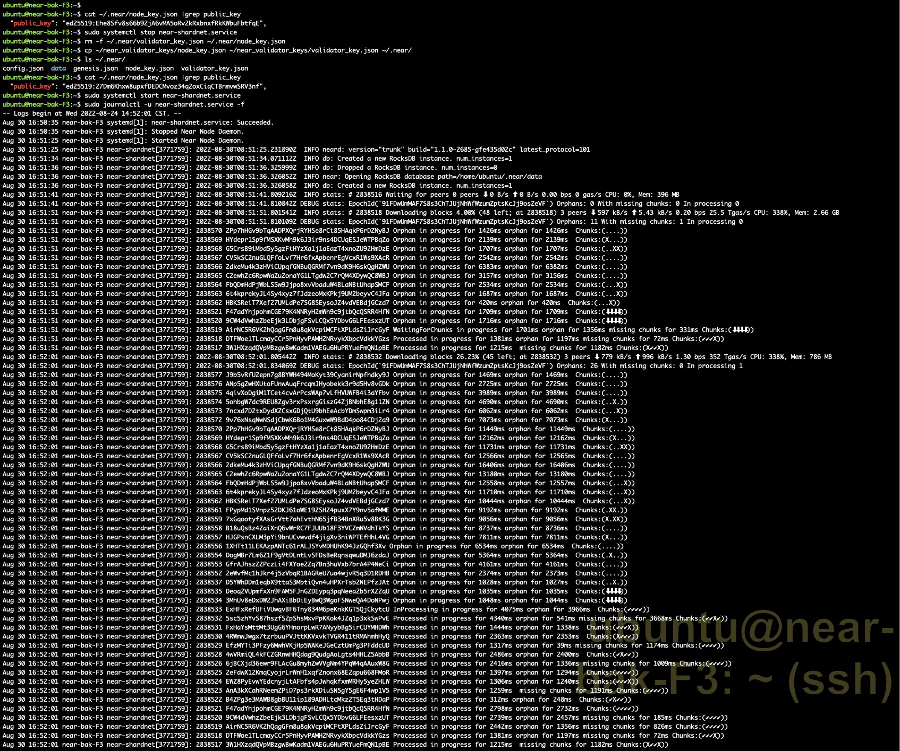

# challange 013

> 设置备份节点

## 操作

部署一个备份节点，从主节点迁移`node_key`和`validator_key`到备份节点

- 主节点 near-main-F4
- 备份节点 near-bak-F3

### near-main-F4

```bash
ubuntu@near-main-F4:~$ tree near_*
near_bak_F4_keys
└── node_key.json
near_validator_keys
├── node_key.json
└── validator_key.json

0 directories, 3 files
ubuntu@near-main-F4:~$ cat ~/.near/node_key.json |grep public_key
  "public_key": "ed25519:27Dm6Khxw8upxfDEDCMvoz34q2oxCiqCTBnmvwSRV3nf",
ubuntu@near-main-F4:~$ sudo systemctl stop near-shardnet.service
ubuntu@near-main-F4:~$ rm ~/.near/validator_key.json ~/.near/node_key.json
ubuntu@near-main-F4:~$ cp near_bak_F4_keys/node_key.json ~/.near
ubuntu@near-main-F4:~$ cat ~/.near/node_key.json |grep public_key
  "public_key": "ed25519:BbY96iHpfAbtQz4uZriDQqQE8mwVTXyJRUUN96MN42R",
# ubuntu@near-main-F4:~$ sudo systemctl start near-shardnet.service
# ubuntu@near-main-F4:~$ sudo journalctl -u near-shardnet.service -f --no-hostname
```

### near-bak-F3

```bash
ubuntu@near-bak-F3:~$ tree near_*
near_bak_F3_keys
└── node_key.json
near_validator_keys
├── node_key.json
└── validator_key.json

0 directories, 3 files
ubuntu@near-bak-F3:~$ cat ~/.near/node_key.json |grep public_key
  "public_key": "ed25519:Ehe8Sfv8s66b92jA6vMA5oRv2kRxbnxfRkKWbuFbtfqE",
ubuntu@near-bak-F3:~$ sudo systemctl stop near-shardnet.service
ubuntu@near-bak-F3:~$ rm -f ~/.near/validator_key.json ~/.near/node_key.json
ubuntu@near-bak-F3:~$ cp ~/near_validator_keys/node_key.json ~/near_validator_keys/validator_key.json ~/.near/
ubuntu@near-bak-F3:~$ cat ~/.near/node_key.json |grep public_key
  "public_key": "ed25519:27Dm6Khxw8upxfDEDCMvoz34q2oxCiqCTBnmvwSRV3nf",
ubuntu@near-bak-F3:~$ sudo systemctl start near-shardnet.service
ubuntu@near-bak-F3:~$ sudo journalctl -u near-shardnet.service -f --no-hostname

```

### 执行结果

查看结果：


## End

至此，near-shardnet 013部分完结。
感谢！
