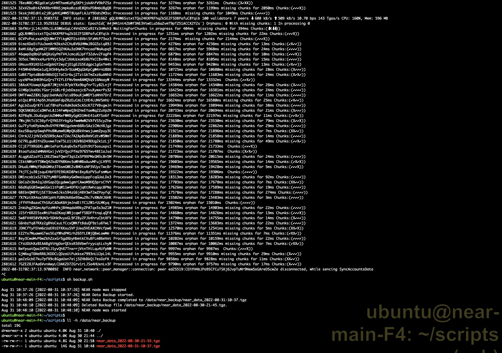
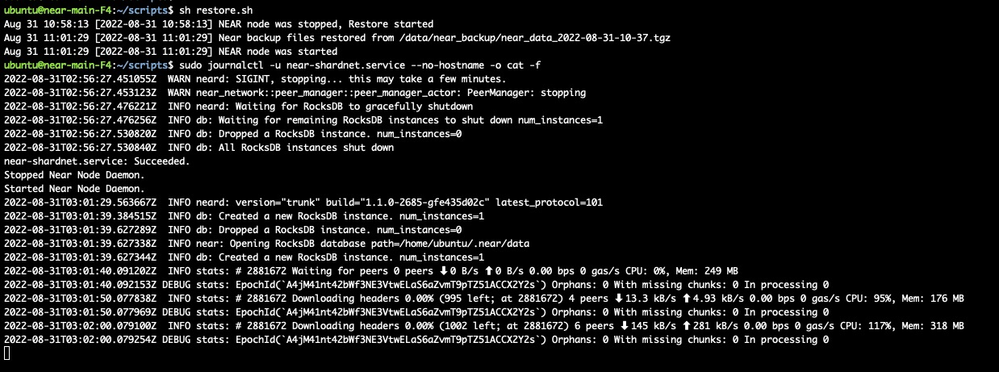

# challange 014

> 自动备份和恢复脚本

## backup

设置crontab

```shell
55 21 * * * sh /home/ubuntu/scripts/backup.sh >> /home/ubuntu/scripts/backup.log
```

backup脚本内容详见[scripts/014-backup.sh](./scripts/014-backup.sh)

执行结果如下：


## restore

restore脚本内容详见[scripts/014-backup.sh](./scripts/014-restore.sh)

执行结果如下：


## End

至此，near-shardnet 014部分完结。
感谢！
