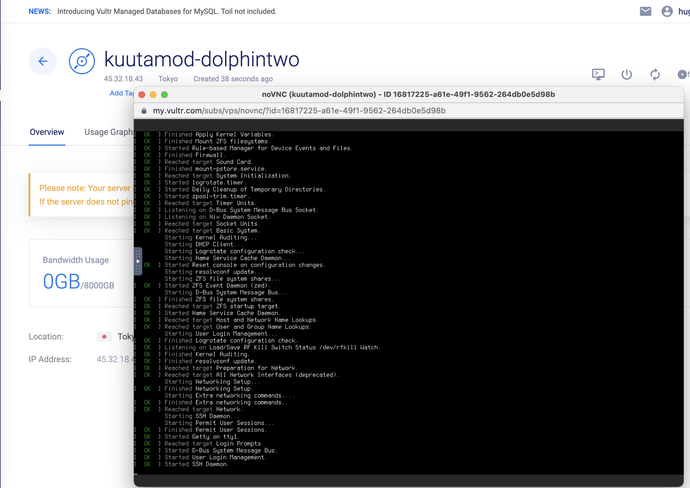
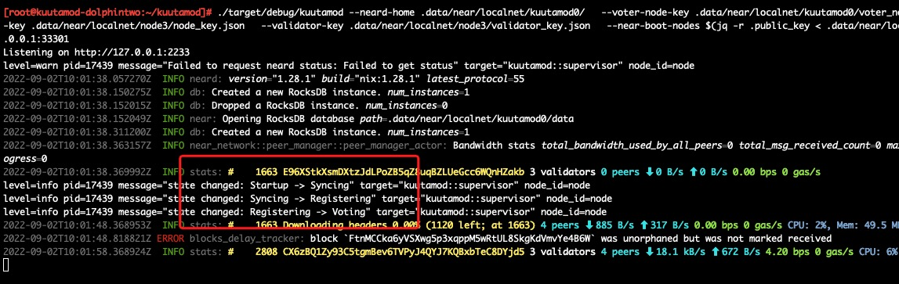

# challange 015

> 使用NixOS实现near的localnet高可用

[TOC]

## Vultr安装NixOS

登陆打开Vultr，访问[https://my.vultr.com/iso/add/](https://my.vultr.com/iso/add/)


上传远端镜像 `https://channels.nixos.org/nixos-22.05/latest-nixos-minimal-x86_64-linux.iso`。


通电，安装系统，可通过vnc连接查看

因为Nix系统安装不包含分区功能，所以我们需要在安装后进行磁盘分区,
所选的Vultr机器是350G磁盘，我们分出300G来使用

```bash
sudo passwd root

parted /dev/vda 
- mklabel - msdos
- mkpart - primary - 1MiB - 300GiB
- print
- quit

mkfs.ext4 -L datamount /dev/vda1
mount /dev/disk/by-label/datamount /mnt
nixos-generate-config --root /mnt
# 此时查看df -Th，可以看到一块300G的vda1盘挂载在/data目录
nano /mnt/etc/nixos/configuration.nix

>>>
  nix.settings.experimental-features = [ "nix-command" "flakes" ];
  boot.loader.grub.device = "/dev/vda";
  networking.hostName = "kuutamod-dolphintwo";
  time.timeZone = "Asia/Tokyo";
  services.openssh.enable = true;
  environment.systemPackages = with pkgs; [
    wget vim rustup gcc
  ];
<<<
mkdir -p ~/.config/nix
echo 'experimental-features = nix-command flakes' >> ~/.config/nix/nix.conf
# 安装NixOS
nixos-install 
```

安装成功


**安装完系统后，需要弹出ISO镜像，重新上电开机。启动成功后，此时vnc中会显示主机名为刚刚设置的`networking.hostName = "kuutamod-dolphintwo";`**


> 特别需要注意此处的操作，否则一直在引导系统中，无法执行后续

```bash
# 使用root登入系统，此处是在VNC中执行的
# 添加操作用户dd，并赋sudo权
useradd dd -d /home/dd -m
passwd dd
visudo
>>>
dd ALL=(ALL:ALL) SETENV: ALL 
<<<

```

## 1. localnet测试

### 安装依赖

```bash
su - root

nix-env -i git
git clone https://github.com/kuutamolabs/kuutamod
cd kuutamod
nix develop
```


### hivemind启动localnet

```bash
# 安装完kuutamod
# 使用hivemind启动localnet
hivemind
# 可以使用screen放到后端运行
```


图中可以看到启动了3个节点`node0`,`node1`,`node2`。他们的`peers`都是2，块高都是0。


### 启动双副本验证人

#### 启动验证人-1

新开一个终端，激活第一个节点验证人角色

```bash
su - root
cd ~/kuutamod
# 首先要安装rustc，装系统的时候只安装了rustup工具
rustup install stable
nix-shell -p bash
# 此处直接 cargo build 会遇到"error occurred: Failed to find tool. Is `ar` installed?"错误
# 解决方案这里有提及https://github.com/NixOS/nixpkgs/issues/55995#issuecomment-504754044
cargo build

nix-env -i jq
nix develop

./target/debug/kuutamod --neard-home .data/near/localnet/kuutamod0/ \
  --voter-node-key .data/near/localnet/kuutamod0/voter_node_key.json \
  --validator-node-key .data/near/localnet/node3/node_key.json \
  --validator-key .data/near/localnet/node3/validator_key.json \
  --near-boot-nodes $(jq -r .public_key < .data/near/localnet/node0/node_key.json)@127.0.0.1:33301
```


此时可以注意到第一个终端中`hivemind`显示的日志，区块高度已经开始动起来了，`peers`也变成了3。


#### 激活验证人-2

```bash
su - root
cd kuutamod
nix develop
./target/debug/kuutamod \
  --exporter-address 127.0.0.1:2234 \
  --validator-network-addr 0.0.0.0:24569 \
  --voter-network-addr 0.0.0.0:24570 \
  --neard-home .data/near/localnet/kuutamod1/ \
  --voter-node-key .data/near/localnet/kuutamod1/voter_node_key.json \
  --validator-node-key .data/near/localnet/node3/node_key.json \
  --validator-key .data/near/localnet/node3/validator_key.json \
  --near-boot-nodes $(jq -r .public_key < .data/near/localnet/node0/node_key.json)@127.0.0.1:33301
```

操作与启动第一个验证人类似，可以观察到`peers`也变成了4。


### 查看验证人节点状态

#### validator-1

```bash
curl http://localhost:2233/metrics
ls -la .data/near/localnet/kuutamod0/
```

`kuutamod_state{type="Validating"} 1`即，当前出块权在该节点。


#### validator-2

```bash
curl http://localhost:2234/metrics
ls -la .data/near/localnet/kuutamod1/
```

`kuutamod_state{type="Validating"} 0`即，当前该节点只是作为全节点同步。


### HA校验

- 检测关掉第一个验证人节点，那第二个节点应该接手出块权。

在第二个终端，即前台运行validator-1节点的终端，使用Ctrl+C终止节点。

此时可以看到第二台验证人显示接管出块权。

validator-1状态 `Validating` -> `Shutdown`
validator-2状态 `Voting` -> `Validating`


重新查看`metrics`， `validator-1`已经关闭，`validator-2`接手出块权。


非正常停机状态下，validator_key的软链并没有解除，此时，应疑惑还有双签可能，所以还要测试故障恢复。


恢复validator-1，可以观察到他的状态的变化过程如下：
`Startup` -> `Syncing` -> `Registering`  -> `Voting`



重新查看软链的指向，可以观察到，`validator_key`只指向`validator-2`，`validator-1`的软链已被取消。在节点启动时会检测软链情况并及时修改，避免出现双签的可能。


## 2. kuutamod部署testnet

[TODO]

## End

至此，near-shardnet 014部分完结。
感谢！
